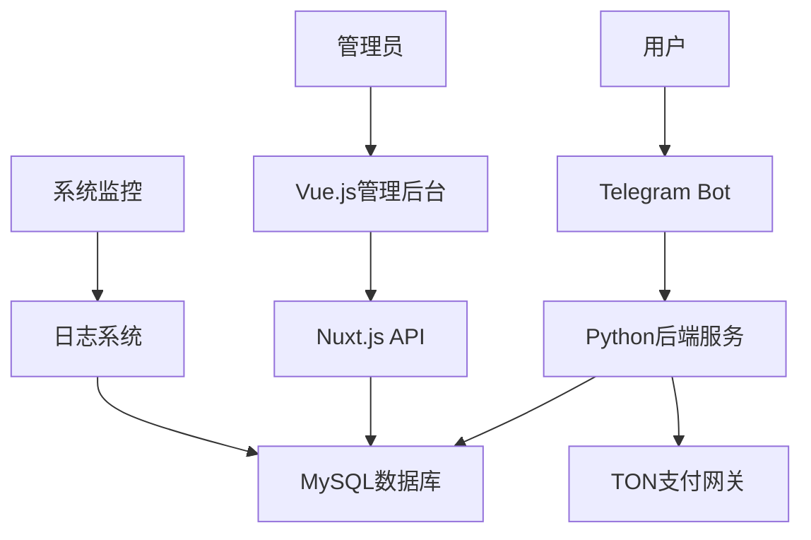

# 🤖 HF-TGPro Admin Dashboard

<div align="center">


[](LICENSE)
[](https://vuejs.org/)
[](https://nuxt.com/)
[](https://www.typescriptlang.org/)

**🚀 专业的Telegram机器人管理后台系统**

*全自动化TG会员销售 • 可视化管理界面 • 企业级解决方案*

[📱 在线演示](https://t.me/HFTGPRObot) • [📖 使用文档](#使用指南) • [🛠️ 快速开始](#快速开始) • [💬 技术支持](#技术支持)

</div>

---

## ✨ 系统特色

<table>
<tr>
<td width="50%">

### 🎯 核心功能
- 🤖 **智能机器人管理** - 多机器人统一管控
- 💰 **自动化会员销售** - TON支付自动充值
- 📊 **实时数据分析** - 订单统计与用户分析  
- 🔐 **安全权限管理** - 多级用户权限控制
- 📱 **响应式界面** - 完美适配各种设备

</td>
<td width="50%">

### 🛠️ 技术架构
- ⚡ **Vue 3 + Nuxt 3** - 现代化前端框架
- 🎨 **Tailwind CSS** - 原子化CSS设计
- 📡 **RESTful API** - 标准化接口设计
- 🗄️ **MySQL数据库** - 稳定可靠的数据存储
- 🔄 **实时更新** - 热重载开发体验

</td>
</tr>
</table>

---

## 🎮 功能展示

<details>
<summary>📊 <strong>仪表板概览</strong></summary>

- 📈 实时订单统计
- 👥 用户增长趋势  
- 💵 收入数据分析
- 🔔 系统状态监控

</details>

<details>
<summary>🤖 <strong>机器人管理</strong></summary>

- 🎛️ 机器人配置管理
- 📝 自定义回复设置
- ⌨️ 内联键盘配置
- 🔧 命令管理系统

</details>

<details>
<summary>💰 <strong>订单系统</strong></summary>

- 📋 订单列表管理
- 🔍 高级搜索筛选
- 📊 订单状态跟踪
- 💳 支付记录查询

</details>

<details>
<summary>👤 <strong>用户管理</strong></summary>

- 👥 用户信息管理
- 🏷️ 用户标签系统
- 📊 用户行为分析
- 🔐 权限分配管理

</details>

---

## 🚀 快速开始

### 📋 系统要求

```bash
Node.js >= 18.0.0
MySQL >= 8.0
Python >= 3.8 (机器人服务)
```

### ⚡ 一键安装

```bash
# 克隆项目
git clone https://github.com/cnmbdb/hf-tgpro-admin.git
cd hf-tgpro-admin

# 安装依赖
npm install

# 配置环境变量
cp .env.example .env
# 编辑 .env 文件，填入您的配置信息

# 启动开发服务器
npm run dev
```

### 🔧 环境配置

<details>
<summary>点击查看详细配置</summary>

```env
# 数据库配置
DB_HOST=127.0.0.1
DB_USER=your_username
DB_PASSWORD=your_password
DB_NAME=hftgpro
DB_PORT=3306

# Telegram Bot配置
BOT_TOKEN=your_bot_token
BOT_USERNAME=your_bot_username

# TON支付配置
TON_API_KEY=your_ton_api_key

# 安全配置
NUXT_SECRET_KEY=your_secret_key
```

</details>

---

## 📦 产品规格

<div align="center">

| 版本 | 价格 | 功能特性 | 适用场景 |
|------|------|----------|----------|
| 🎯 **基础版** | 5U起 | 基础机器人功能 | 个人使用、功能演示 |
| ⭐ **标准版** | 25U/月 | 完整销售功能 | 小型商户、个体经营 |
| 🏢 **商家版** | 200U/年 | 独立部署、源码 | 中型企业、定制需求 |
| 🚀 **企业版** | 900U/永久 | 群控管理、无限授权 | 大型企业、代理商 |

</div>

---

## 🛠️ 使用指南

### 📱 机器人配置

1. **创建Telegram机器人**
   ```
   与 @BotFather 对话创建机器人
   获取 Bot Token
   ```

2. **配置机器人信息**
   - 设置机器人头像和描述
   - 配置机器人命令菜单
   - 设置Webhook地址

3. **启动机器人服务**
   ```bash
   cd hf-tgpro
   python main.py
   ```

### 💰 支付配置

<details>
<summary>TON支付集成</summary>

```javascript
// TON支付配置示例
const tonConfig = {
  apiKey: 'your_ton_api_key',
  network: 'mainnet', // 或 'testnet'
  webhook: 'https://yourdomain.com/api/ton/webhook'
}
```

</details>

---

## 📊 系统架构



---

## 🔧 开发指南

### 📁 项目结构

```
hf-tgpro-admin/
├── 📁 pages/              # 页面组件
├── 📁 components/         # 可复用组件  
├── 📁 server/api/         # API接口
├── 📁 assets/             # 静态资源
├── 📁 hf-tgpro/          # Python机器人服务
├── 📄 nuxt.config.ts     # Nuxt配置
└── 📄 package.json       # 项目依赖
```

### 🎨 UI组件

本项目使用 [Nuxt UI](https://ui.nuxt.com/) 组件库，提供：

- 🎯 现代化设计风格
- 🌙 深色/浅色主题切换
- 📱 完全响应式布局
- ♿ 无障碍访问支持

---

## 🔐 安全特性

<div align="center">

| 安全功能 | 描述 |
|----------|------|
| 🔒 **JWT认证** | 安全的用户身份验证 |
| 🛡️ **权限控制** | 细粒度的访问权限管理 |
| 🔐 **数据加密** | 敏感数据加密存储 |
| 📝 **操作日志** | 完整的操作审计跟踪 |
| 🚫 **防护机制** | SQL注入、XSS攻击防护 |

</div>

---

## 📈 性能优化

- ⚡ **服务端渲染(SSR)** - 更快的首屏加载
- 🗜️ **代码分割** - 按需加载减少包体积
- 💾 **智能缓存** - Redis缓存提升响应速度
- 📊 **数据库优化** - 索引优化查询性能
- 🔄 **CDN加速** - 静态资源全球加速

---

## 🤝 贡献指南

我们欢迎所有形式的贡献！

### 🐛 报告问题

在 [Issues](https://github.com/cnmbdb/hf-tgpro-admin/issues) 页面报告bug或提出功能建议

### 💡 提交代码

1. Fork 本仓库
2. 创建特性分支 (`git checkout -b feature/AmazingFeature`)
3. 提交更改 (`git commit -m 'Add some AmazingFeature'`)
4. 推送到分支 (`git push origin feature/AmazingFeature`)
5. 创建 Pull Request

---

## 📞 技术支持

<div align="center">

### 🎯 联系方式

[](https://t.me/HFTGPRObot)
[](https://hfz.pw/archives/1298)

**📧 商务合作** | **🛠️ 技术支持** | **📱 产品演示**

</div>

### 💬 社区支持

- 📖 [使用文档](https://github.com/cnmbdb/hf-tgpro-admin/wiki)
- 🐛 [问题反馈](https://github.com/cnmbdb/hf-tgpro-admin/issues)
- 💡 [功能建议](https://github.com/cnmbdb/hf-tgpro-admin/discussions)

---

## 📄 开源协议

本项目采用 [GPL v3](LICENSE) 开源协议

```
Copyright (C) 2024 HF-TGPro Team

This program is free software: you can redistribute it and/or modify
it under the terms of the GNU General Public License as published by
the Free Software Foundation, either version 3 of the License.
```

---

<div align="center">

### 🌟 如果这个项目对您有帮助，请给我们一个Star！

[](https://star-history.com/#cnmbdb/hf-tgpro-admin&Date)

**Made with ❤️ by HF-TGPro Team**

</div>
